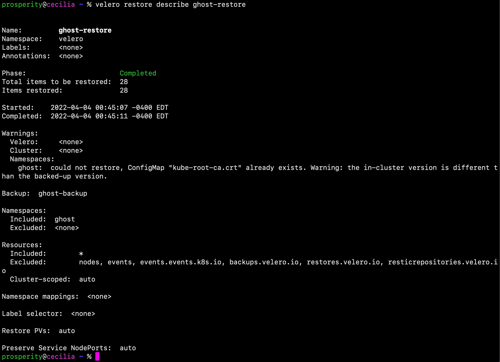
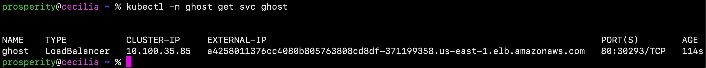

## _Backup and restore your Amazon EKS cluster resources using Velero_

## Overview

Hello and welcome! My name is Cecilia, and in this amazing project, I will demonstrate how to use Velero to back up, restore, and migrate our Amazon EKS cluster resources. As companies around the world continue to adopt the usage of containers to encapsulate their microservices, it is becoming increasingly important to have a centralized backup system. 

The backup tool that we will utilize is [Velero](https://velero.io/). This amazing tool has many great features, including: Kubernetes cluster disaster recovery, data migration, and data protection. Velero can be integrated with Amazon EKS through the use of snapshots of the cluster’s persistent volumes, which can be restored with the cluster’s objects.

This tool creates protection for apps in case of physical and logical errors, migration capabilities between Kubernetes clusters, and the ability to replicate production clusters across development and testing environments.


----------------------------------------------------------------------------------------
### PART 1: Getting Started

Before we begin, we must install and/or setup some services on our local PC. Here is an overview of the software and tools that must be installed and configured:

- `AWS CLI` version 2. See [Installing AWS CLI](https://docs.aws.amazon.com/cli/latest/userguide/install-cliv2.html).
- `eksctl` v0.58 or greater. See [Installing eksctl]((https://docs.aws.amazon.com/eks/latest/userguide/eksctl.html#installing-eksctl)).
- `kubectl`. See [Installing kubectl](https://docs.aws.amazon.com/eks/latest/userguide/install-kubectl.html).

- `Helm v3`. See [Installing Helm](https://helm.sh/docs/intro/install/).

- Create **two** EKS clusters
    - The first cluster will be named `Primary`
    - The second cluster will be named `Recovery`
    

#### Creating Clusters

The clusters can be created on the AWS management console. See [creating an EKS cluster](https://docs.aws.amazon.com/eks/latest/userguide/create-cluster.html) to learn more. After you have created the clusters, navigate to the `Amazon Elastic Kubernetes service (EKS)`. Before you proceed to the next section, ensure that the clusters are running in the **active** status.


Next, from the command line, ensure that OIDC is configured for **both** of the clusters. See [creating an OIDC provider](https://docs.aws.amazon.com/eks/latest/userguide/enable-iam-roles-for-service-accounts.html) to learn more.


------------------------------------------
### PART 2: Installing Velero

Great job! Now that we have completed the pre-requisites, let's install Velero! First, begin by creating an S3 bucket. The reason for this is that Velero uses S3 to store EKS backups when running in AWS.

S3 bucket names **must** be unique globally. Here's an example of a bucket name that I created: 

`velerobucketcecilia`

You can create an S3 bucket directly from the AWS CLI on your local PC using the following command:

```bash
$ aws s3 mb s3://$BUCKET --region $REGION
```

_Please note: Be sure to replace `$BUCKETNAME` and`$REGION` with your own values._

On the AWS management console, you may view your newly created bucket by navigating to the `Amazon S3` service. Click the `Buckets` section to view your bucket.


#### IAM Policy

Next, we will use [IAM roles for service accounts](https://docs.aws.amazon.com/eks/latest/userguide/iam-roles-for-service-accounts.html) to grant permissions to perform backup and restore operations. On the AWS CLI, use the following command to create a json policy. Be sure to replace `${BUCKET}` with the name of your newly created S3 bucket:

```bash
cat > velero_policy.json <<EOF
{
    "Version": "2012-10-17",
    "Statement": [
        {
            "Effect": "Allow",
            "Action": [
                "ec2:DescribeVolumes",
                "ec2:DescribeSnapshots",
                "ec2:CreateTags",
                "ec2:CreateVolume",
                "ec2:CreateSnapshot",
                "ec2:DeleteSnapshot"
            ],
            "Resource": "*"
        },
        {
            "Effect": "Allow",
            "Action": [
                "s3:GetObject",
                "s3:DeleteObject",
                "s3:PutObject",
                "s3:AbortMultipartUpload",
                "s3:ListMultipartUploadParts"
            ],
            "Resource": [
                "arn:aws:s3:::${BUCKET}/*"
            ]
        },
        {
            "Effect": "Allow",
            "Action": [
                "s3:ListBucket"
            ],
            "Resource": [
                "arn:aws:s3:::${BUCKET}"
            ]
        }
    ]
}
EOF

aws iam create-policy \
    --policy-name VeleroAccessPolicy \
    --policy-document file://velero_policy.json

```


#### Create Service Accounts for Velero

**eksctl** allows users to create the required IAM role and scope the trust relationship to the velero-server Service Account! 

 
- To obtain your AWS account number, use the following command. Be sure to take note of this number:

```
$ aws sts get-caller-identity --query Account --output text
```

- Next, create the service account for Velero using the following command. Remember to replace `<CLUSTERNAME>` with the name of your `Primary` and `Recovery` EKS cluster accordingly:

```bash
eksctl create iamserviceaccount \
--cluster=$PRIMARY_CLUSTER \
--name=velero-server \
--namespace=velero \
--role-name=eks-velero-backup \
--role-only \
--attach-policy-arn=arn:aws:iam::$ACCOUNT:policy/VeleroAccessPolicy \
--approve

eksctl create iamserviceaccount \
--cluster=$RECOVERY_CLUSTER \
--name=velero-server \
--namespace=velero \
--role-name=eks-velero-recovery \
--role-only \
--attach-policy-arn=arn:aws:iam::$ACCOUNT:policy/VeleroAccessPolicy \
--approve

```


#### Install Velero in both EKS Clusters

Install Velero using the following Helm chart:

```bash
$ helm repo add vmware-tanzu https://vmware-tanzu.github.io/helm-charts

cat > values.yaml <<EOF
configuration:
  backupStorageLocation:
    bucket: $BUCKET
  provider: aws
  volumeSnapshotLocation:
    config:
      region: $REGION
credentials:
  useSecret: false
initContainers:
- name: velero-plugin-for-aws
  image: velero/velero-plugin-for-aws:v1.2.0
  volumeMounts:
  - mountPath: /target
    name: plugins
serviceAccount:
  server:
    annotations:
      eks.amazonaws.com/role-arn: "arn:aws:iam::${ACCOUNT}:role/eks-velero-backup"
EOF

cat > values_recovery.yaml <<EOF
configuration:
  backupStorageLocation:
    bucket: $BUCKET
  provider: aws
  volumeSnapshotLocation:
    config:
      region: $REGION
credentials:
  useSecret: false
initContainers:
- name: velero-plugin-for-aws
  image: velero/velero-plugin-for-aws:v1.2.0
  volumeMounts:
  - mountPath: /target
    name: plugins
serviceAccount:
  server:
    annotations:
      eks.amazonaws.com/role-arn: "arn:aws:iam::${ACCOUNT}:role/eks-velero-recovery"
EOF

```


Next, we must install the Velero server in the `Primary` cluster and again in the `Recovery` cluster! For easier management of `kubectl config`, we add our clusters to `kubeconfig` with an alias:

```bash
$ aws eks --region $REGION update-kubeconfig --name $PRIMARY_CLUSTER --alias $PRIMARY_CONTEXT
$ aws eks --region $REGION update-kubeconfig --name $RECOVERY_CLUSTER --alias $RECOVERY_CONTEXT

```


Next, we can check that we have these new contexts with the following command:

```
$ kubectl config get-contexts
```


Use the following commands to change the context to your `Primary` cluster and then install Velero:

```bash
$ kubectl config use-context $PRIMARY_CONTEXT

$ helm install velero vmware-tanzu/velero \
    --create-namespace \
    --namespace velero \
    -f values.yaml

```


Similarly, use the following command to change the context to your `Recovery` cluster and then install Velero:

```bash
$ kubectl config use-context $RECOVERY_CONTEXT

$ helm install velero vmware-tanzu/velero \
    --create-namespace \
    --namespace velero \
    -f values_recovery.yaml

```


Nice work! We can check that the Velero server was successfully installed by running this command:

```
$ kubectl get pods --all-namespaces
```


#### Install the Velero CLI

Lastly, we will install the Velero CLI. This will help simplify how we interact with this tool. The installation instructions vary depending on your operating system. See [Installing Velero CLI](https://velero.io/docs/v1.6/basic-install/#install-the-cli) to learn more.

- In my case, I used the following command to install/update the Velero CLI:

```
$ brew install velero
```


---------------------------------------------------------------

### PART 3: Backup and restore an application

In this section, we will install an application in our `Primary` cluster and then back up and restore it in our `Recovery` cluster!

Ghost will serve as our sample application. We will use the [Bitnami Helm chart](https://github.com/bitnami/charts/tree/master/bitnami/ghost). This chart depends on the [Bitnami MariaDB chart](https://github.com/bitnami/charts/tree/master/bitnami/mariadb), which will serve as the persistent data store for the blog application.  Velero will take snapshots as part of performing the backup!

- Use the following commands to switch to the `Primary` cluster’s context and install Ghost:

_**Please Note:** Ignore the notification **`ERROR: you did not provide an external host`** when you install Ghost. This will be solved with the following commands_:

```bash
$ helm repo add bitnami https://charts.bitnami.com/bitnami

$ kubectl config use-context $PRIMARY_CONTEXT
helm install ghost bitnami/ghost \
    --create-namespace \
    --namespace ghost
export APP_HOST=$(kubectl get svc --namespace ghost ghost --template "{{ range (index .status.loadBalancer.ingress 0) }}{{ . }}{{ end }}")export GHOST_PASSWORD=$(kubectl get secret --namespace "ghost" ghost -o jsonpath="{.data.ghost-password}" | base64 --decode)export MARIADB_ROOT_PASSWORD=$(kubectl get secret --namespace "ghost" ghost-mariadb -o jsonpath="{.data.mariadb-root-password}" | base64 --decode)export MARIADB_PASSWORD=$(kubectl get secret --namespace "ghost" ghost-mariadb -o jsonpath="{.data.mariadb-password}" | base64 --decode)
helm upgrade ghost bitnami/ghost \
  --namespace ghost \
  --set service.type=LoadBalancer \
  --set ghostHost=$APP_HOST \
  --set ghostPassword=$GHOST_PASSWORD \
  --set mariadb.auth.rootPassword=$MARIADB_ROOT_PASSWORD \
  --set mariadb.auth.password=$MARIADB_PASSWORD
```


- We can check that the installation was successful by running this command:

```
$ kubectl get pods --all-namespaces
```


------------------------------------------------------------------

#### Create a blog post to demonstrate backup and restore of persistent volume

Great job on completing the Helm chart installation! The Chart README will be displayed in the console. It includes the following:

- The Blog URL
- The Admin URL
- The default admin username
- Instructions to use kubectl to retrieve the password

In order to create a blog post, sign in to the Ghost Admin console using the Admin URL provided.


After you sign in, navigate to the Dashboard. To create a post, click `Posts` in the left-hand navigation pane. Then, click `Posts` to create a post.


Create a sample blog post. You can add a post title and write some content. This will be used in the backup and restore process.


Once you are ready to save your sample blog post, select the **Publish** dropdown menu item in the top right corner of the page.


To view your blog with your newly added content, open a new browser tab and enter the blog URL!


-------------------------------------------------------

### PART 4: Create Backup

In this section, we will create a backup of the `Primary` cluster. On the AWS CLI, use the following command to switch your `kubectl` context back to the `Primary` cluster:

```
$ velero backup create ghost-backup
```


Backup and restore operations are declared as Kubernetes Custom Resource Definition (CRD) objects. The Velero backup CRD can be observed using the `-o` flag. This flag outputs the backup CRD YAML without actually submitting the backup creation to the Velero server:

```
$ velero backup create test -o yaml
```


As you can see, in the backup CRD, all namespaces are backed up as the `includedNamespaces`. Even though we are backing up the entire cluster.

#### Validate that the backup was successful

Next, let's validate that the backup has been completed successfully using the following command:

```
$ velero backup describe ghost-backup
```


The backup files created by Velero can also be viewed in the Amazon S3 bucket we previously created:

```
$ aws s3 ls $BUCKET/backups/ghost-backup/
```


--------------------------------------------------

### PART 5: Restore the application into the Recovery cluster

- First, switch your `kubectl` context to your Recovery cluster.

```
$ kubectl config use-context $RECOVERY_CONTEXT
```

- Next, use the following command to restore only the Ghost application into the `Recovery` cluster.

```bash
$ velero restore create ghost-restore \
    --from-backup ghost-backup \
    --include-namespaces ghost
```


#### Validate the restore was successful

Finally, let's validate that the restore has been completed successfully:

```
$ velero restore describe ghost-restore
```



Lastly, retrieve the URL of the **LoadBalancer** for the Ghost blog in the `Recovery` cluster:

```
$ ubectl -n ghost get svc ghost
```



You may verify that your blog has been restored by visiting the URL under `EXTERNAL-IP`. You should see the Ghost blog along with any example blog posts you created in previous steps.


----------------------------------------------------------------------------------------
### PART 6: Cleaning up

To avoid incurring future charges, delete all of the resources!

- On the AWS management console, navigate to S3 service. Then, select and delete each object to empty the bucket. 


- Once you have emptied the bucket, delete the bucket itself.


- Next, navigate to the Elastic Kubernetes Service, and terminate the clusters.


- Please be patient. It may take several minutes for all of the clusters to terminate!


----------------------------------------------------------------------------------------

Congratulations! You successfully backed up your `Primary` cluster and restored your application in the `Recovery` cluster! In this project, I demonstrated how Velero ensures quick recovery from failures and disaster events, as well as seamless migrations for applications and cluster resources in Amazon EKS. Thank you for viewing my project and following along. I hope you enjoyed it! For more details on similar projects and more, please visit my GitHub portfolio: https://github.com/ceciliacloud


 